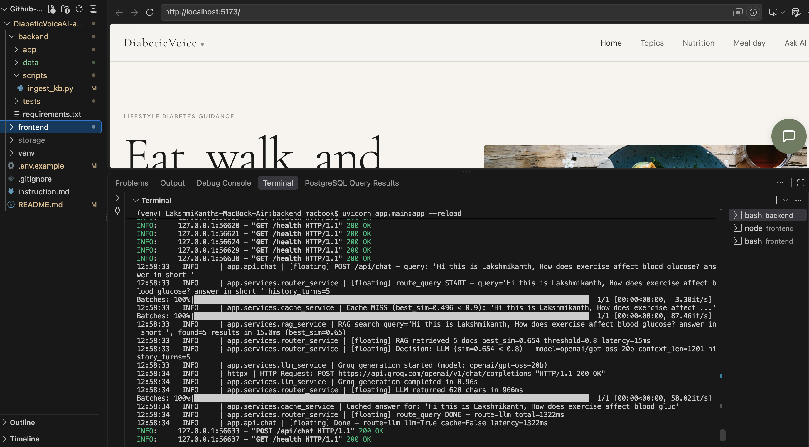
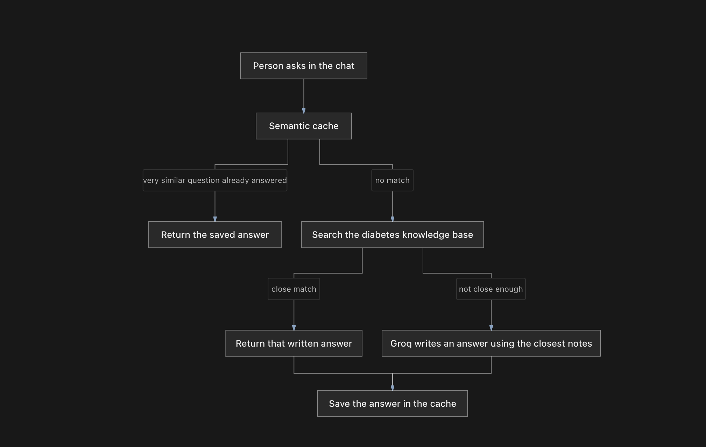
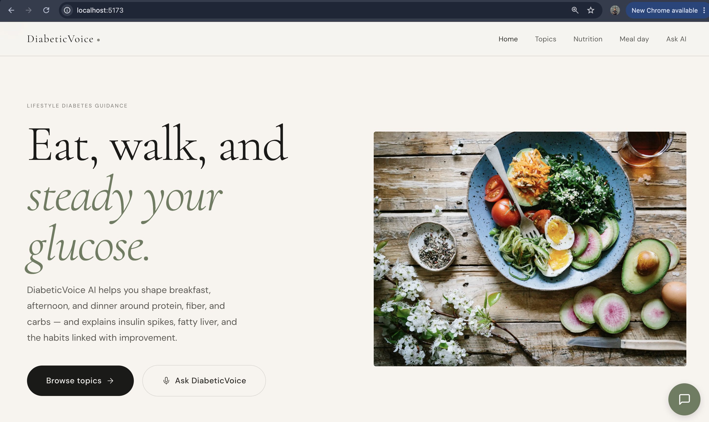
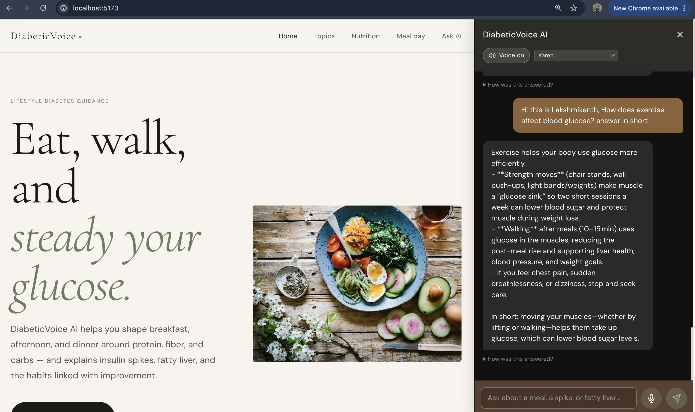

# DiabeticVoice AI

## Screenshots

### Backend Architecture



### Workflow Architecture



### Diabetic UI



### QueryAI



A voice-ready lifestyle guide for people who want steadier glucose and a healthier liver. It suggests what to eat in the morning, afternoon, and at dinner, and explains insulin spikes, protein, carbs, fiber, and fatty liver in plain language.

This is education beside a clinician. It does not diagnose, dose insulin, or tell anyone to stop medicine. Type 2 diabetes can improve for some people with sustained habits. Type 1 diabetes is not reversed by food.

## Features

- **Voice-enabled chat:** Ask with the microphone. Replies can be spoken with the browser speech API.
- **Meal day:** Morning, afternoon, and dinner patterns built from protein, vegetables, and a modest carb portion.
- **Topic library:** Insulin spikes, fatty liver, walking after meals, sleep, and when to get urgent care.
- **Retrieval before the model:** Familiar questions are answered from the local diabetes knowledge base. Groq is used only when the question is too personal for that library.

## Getting started

### Prerequisites
- Python 3.10+
- Node.js 18+
- A Groq API key in `backend/.env` if you want answers beyond the knowledge base (`GROQ_API_KEY`).

### Backend
```bash
cd backend
python -m venv venv
source venv/bin/activate
pip install -r requirements.txt
python scripts/ingest_kb.py
uvicorn app.main:app --reload
```

`ingest_kb.py` loads `backend/data/diabetes_kb.json`. Re-run it after pulling this lifestyle version so retrieval is not still using an older orthopedic index.

### Frontend
```bash
cd frontend
npm install
npm run dev
```

Visit `http://localhost:5173`.
